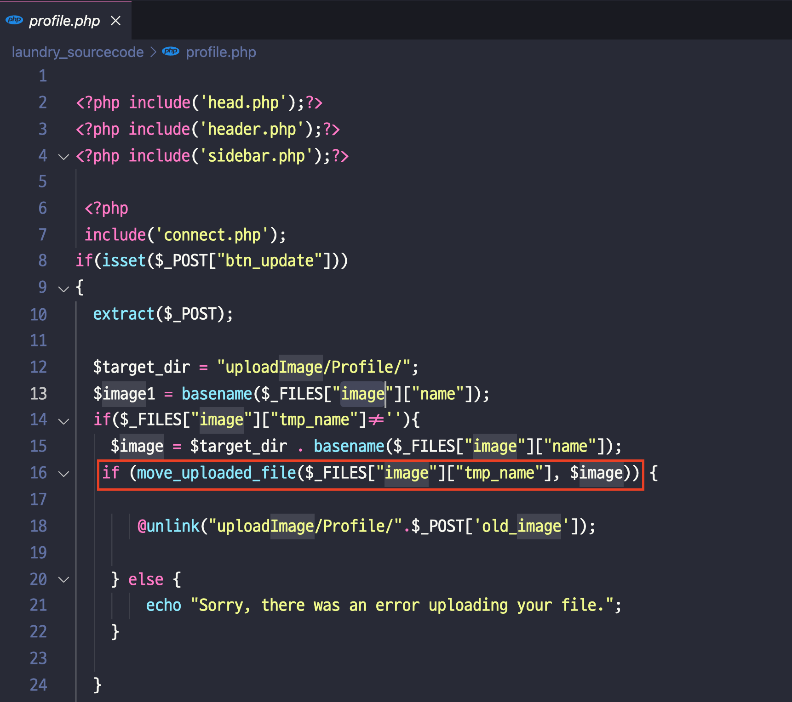
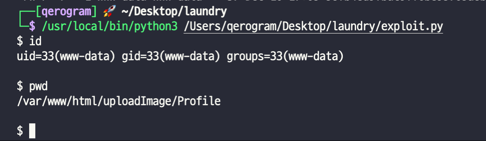

# CVE-2021-45003(Laundry Booking Management System)

 

## Author
Qerogram  

## Version
   

## Vulnerability
RCE(Remote Code Execution) via File Upload  

1) “edit profile” page - Not check permission
 

  
2) Therefore, We can trigger RCE via upload php webshell. 
 

  
# Reference
[1] [Download WebApp from Vendor](https://www.sourcecodester.com/php/14400/laundry-booking-management-system-php-source-code.html)
