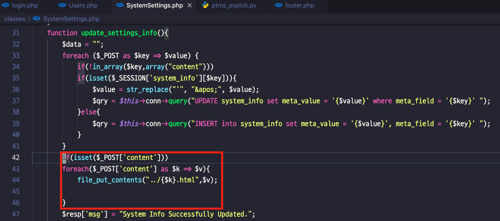
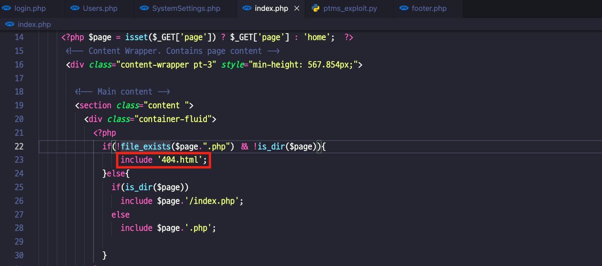
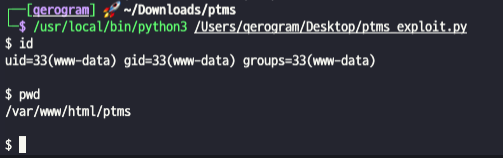

# PTMS

## Author
Qerogram  

## Version
PHP Version :   
PTMS Version :  
 

## Vulnerability
[+] Effect : RCE 

#### Chains the three vulnerabilities below and uses them. 
1. <strong>[Insecure Permission Check]</strong> <t>It does not check user permission when using the arbitrary file writing function.  
2. <strong>[Arbitrary File Write Function]</strong> <t>Limited arbitrary file write function exists.(Possible extension, "html".)

  
3. <strong>[LFI]</strong> <t>the error handling page with the extension "html" is loaded through the keyword "include".

  

Therefore, we can overwrite the "404.html" file, which is an error handler page, with a webshell payload, as if overwriting the SEH handler code, and then invoke the error page to <strong>trigger an RCE vulnerability.</strong>

  
# Reference
[1] [Download WebApp from Vendor](https://www.sourcecodester.com/php/15136/online-project-time-management-system-phpoop-free-source-code.html)