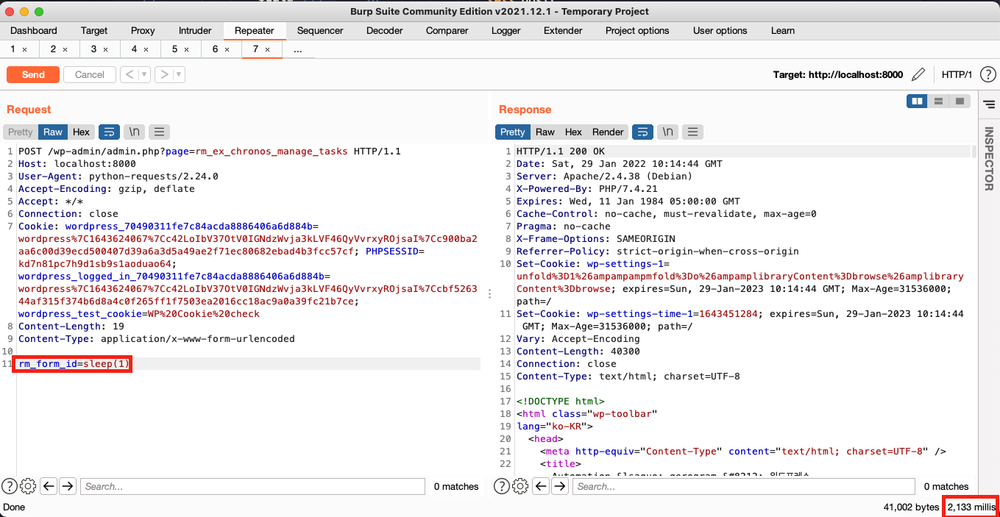

# CVE-2022-0420

## Author
Qerogram<br><br>

## Version
&nbsp; <br><br>

## Vulnerability
SQL Injection<br><br>

<br><br>

## Vector
|Method|Path|
|------|---|
|URI|/wp-admin/admin.php?page=rm_ex_chronos_manage_tasks|
|Local Path|/wp-content/plugins/custom-registration-form-builder-with-submission- manager/plus/chronos/libs/rm_chronos.php – get_tasks()|


<br><br>

## How To Trigger Vulnerability
When the corresponding request is transmitted, manage_tasks() of the "task_controller.php" file is called. In management_task(), get_tasks() is called by including the value of "rm_form _id" input by the user as a factor.(line 35 ~ 36)


<br>
In the 196 line of get_tasks(), a conditional clause in the form of `form_id`=[Payload] is created. When a value called “sleep(1)” is input as a payload, it is ported in the form of `form_id`=sleep(1). Finally generates and executes the Query(Line 202).

```SELECT * FROM wp_rm_tasks WHERE `form_id` = sleep(1) ORDER BY `form_id`, `task_order`, `task_id```


<br>

As a result, a delay of 2 seconds occurred when a response came from the server, indicating that the “Time-based Blind SQLi” attack was successful.



<br>

<br><br>
# Reference
[1] [Vendor](https://registrationmagic.com/)
