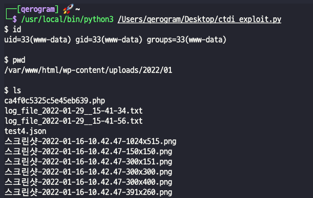
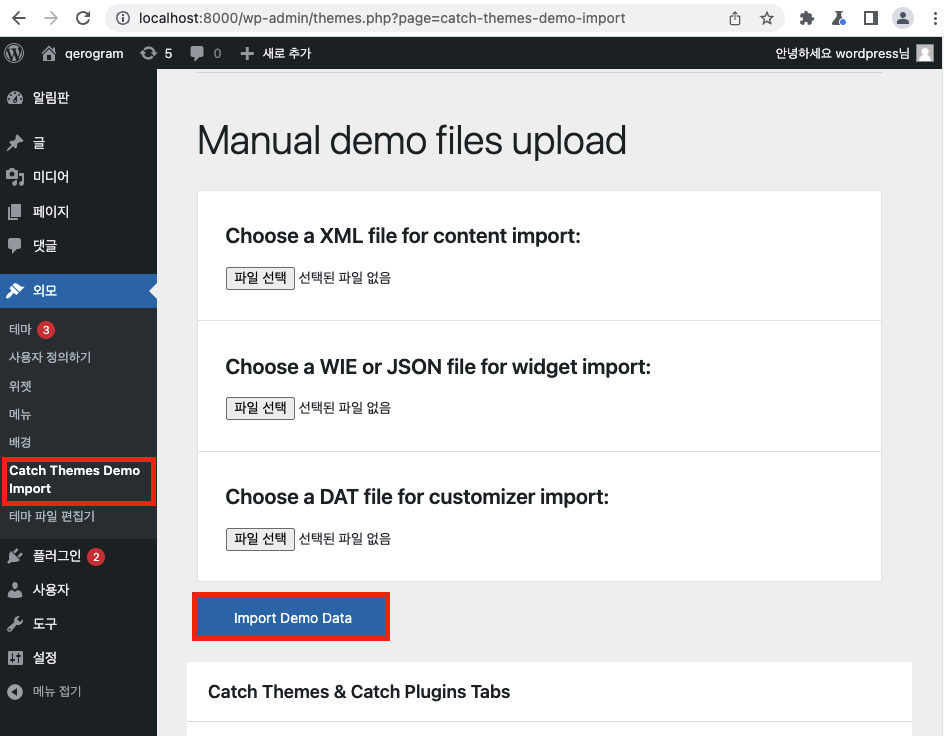
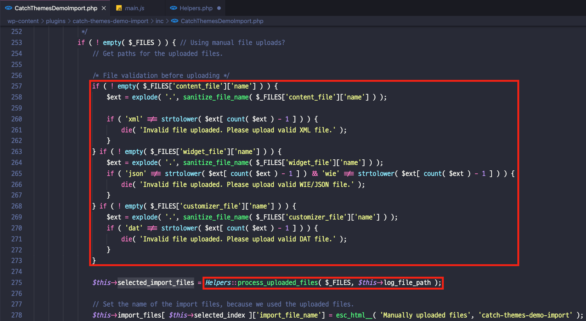
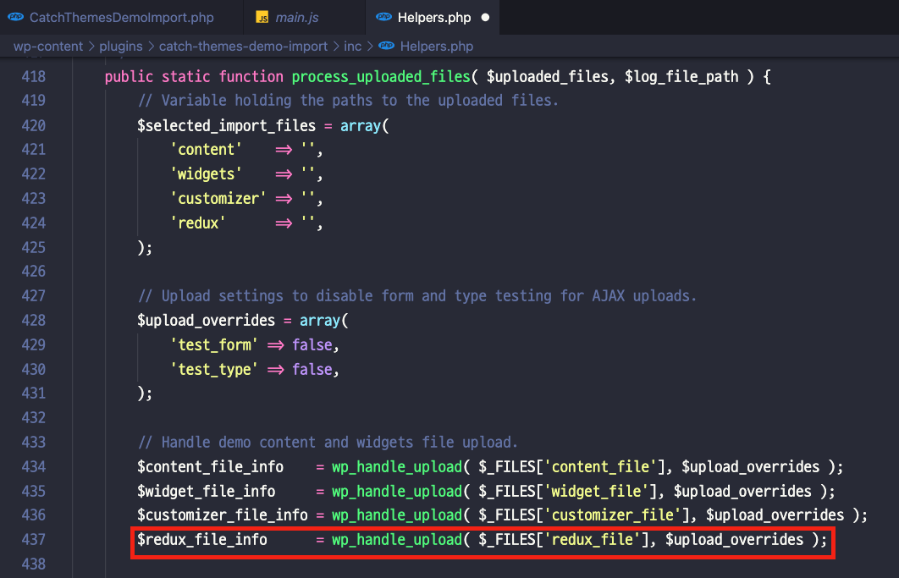

# CVE-2022-0440

 

## Author
Qerogram  

## Version
&nbsp;   

## Vulnerability
RCE (Remote Code Execution) via File Upload  

  

## Vector
|Method|Path|
|------|---|
|URI|wp-admin -> Theme -> Catch Themes Demo Import ->Import Demo Data /wp-admin/admin-ajax.php - parameter : redux_file|
|Local Path|/wp-content/plugins/catch-themes-demo-import/inc/Helpers.php – process_uploaded_files()|

  

## How To Trigger Vulnerability
When button called “Import Demo Data” was clicked, function "/wp-content/plugins/catch-th emes-demo-import/inc/CatchThemesDemoImport.php" - import_demo_data_ajax_callback() is called. This function filters extensions to the "widget_file", "customizer_file", and "content_file" files. And then call process_upload_file()(/wp-content/plugins/catch-themes-demo-import/inc/Helpers.php). 

 

Process_upload_files() uploads the three files filtered above and "redux_file" through wp_handle_upload(), where there is no extension filtering for redux_file, so you can upload the desired file. Accordingly, it is possible to trigger an RCE vulnerability by uploading a web shell.

 
As a result, we get a execute command permission to server. After expoit is successful, it may not work if you attempt exploit again due to an error with redux_plugin. The PoC below solved the problem by initializing redux_file and operating the exploit again.
 

 

  
# Reference
[1] [Vendor](https://wordpress.org/plugins/catch-themes-demo-import/)
