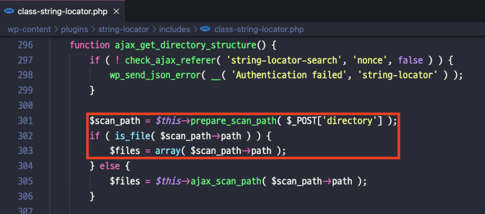
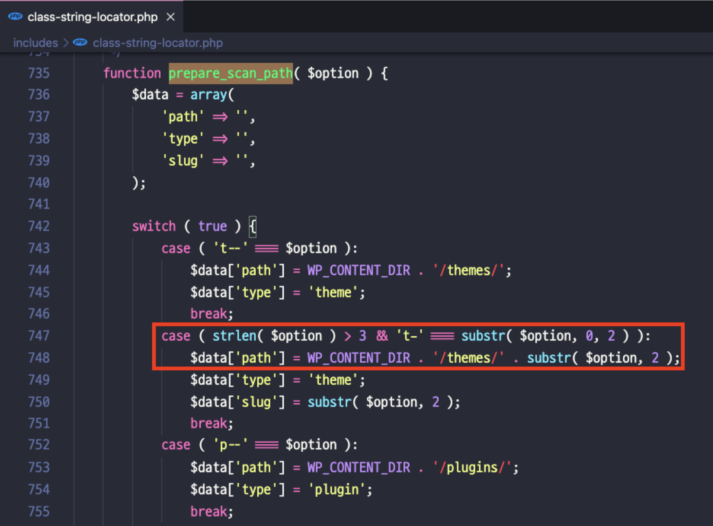
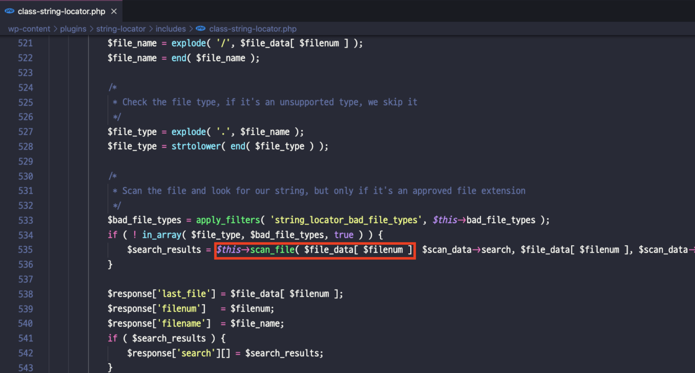
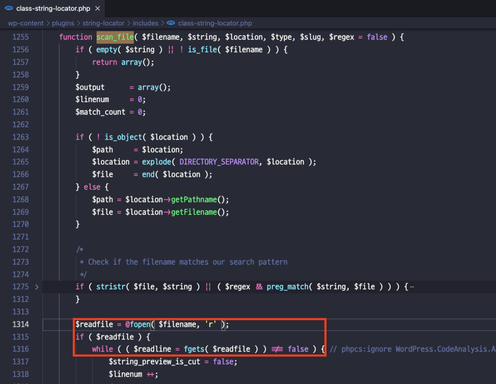
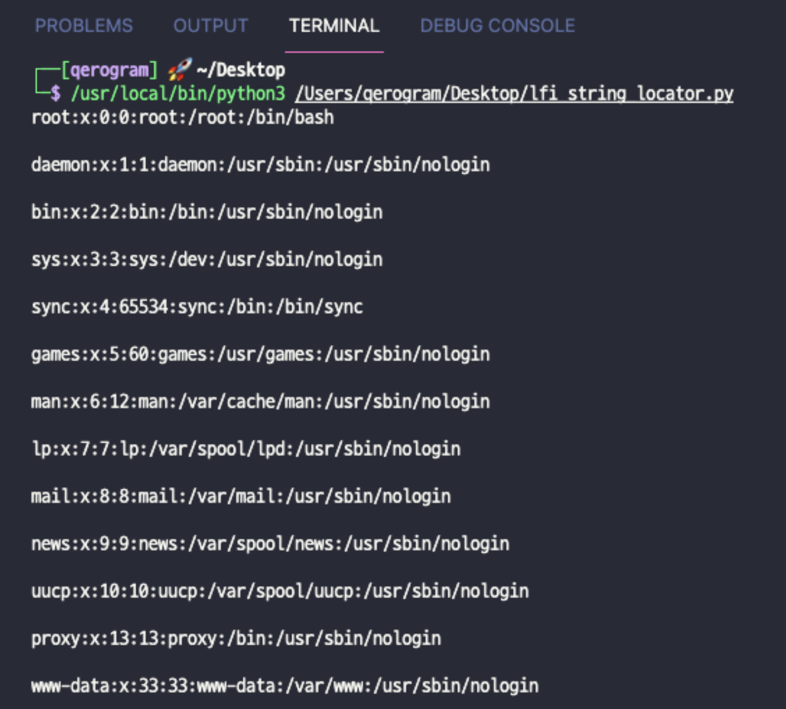

# CVE-2022-0493

 

## Author
Qerogram  

## Version
 &nbsp;   

## Vulnerability
Arbitrary File Read  
  

## Description
The plugin does not properly validate the path of the files to be searched, allowing high privilege users such as admin to query arbitrary files on the web server via a path traversal vector. Furthermore, due to a flaw in the search, allowing a pattern to be provided, which will be used to output the relevant matches from the matching file, all content of the file can be disclosed.
  

## Vector

### Step 1
|Method|Path|
|------|---|
|URI|/wp-admin/admin-ajax.php   - action = string-locator-get-directory-structure  - directory = "t-../../../../../../../{FILENAME}" // not a directory, just a file - search = /.*/i  - regex = true|
|Local Path|/wp-content/plugins/string-locator/includes/class-string-locator.php – ajax_get_directory_structure()|

 

### Step 2
|Method|Path|
|------|---|
|URI|/wp-admin/admin-ajax.php  - action = "string-locator-search" - filenum = "0"|
|Local Path|/wp-content/plugins/string-locator/includes/class-string-locator.php – ajax_file_search()|

  

## How To Trigger Vulnerability
There are separate logics for set a target files and logics for checking files, so you have to go through a total of two processes.

### 1) Targeting Logic
In the ajax_get_directory_structure function, pre-processing of files to be searched in advance is performed. In the ajax_get_directory_structure function, pre-processing of files to be searched in advance is performed. In prepare_scan_path function, have insecure filtering is applied to path.

 

If you start with "t-", you can append all subsequent strings in the path. In this case, you can hypothesize that the sub-path can be accessed by inserting the relative path ("../"). The developer seems to have missed it because security is applied to strings starting with "p-".

### 2) Read Logic
In the ajax_file_search function, the scan_file function is called without a path check process.

 

In the scan_file function, search the contents of the file without a path check process.

As a result, we get a file content.

 

 

  
# Reference
[1] [Vendor](https://wordpress.org/plugins/string-locator/)  
[2] [MITRE](https://cve.mitre.org/cgi-bin/cvename.cgi?name=CVE-2022-0493)