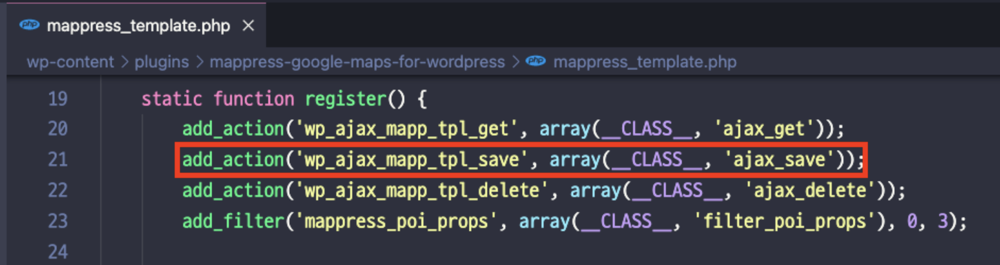
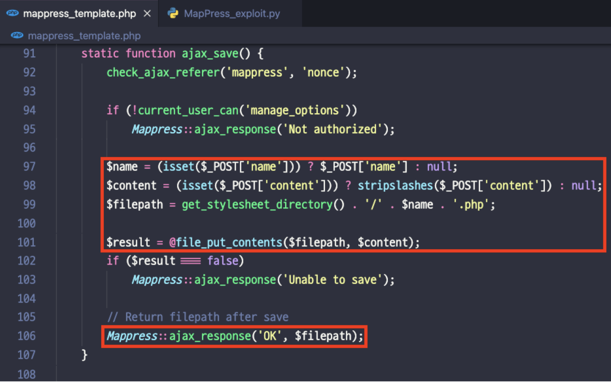
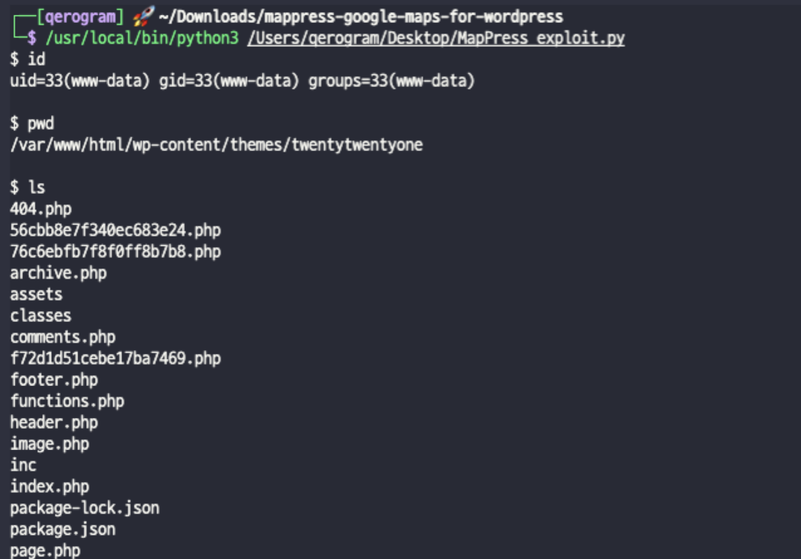

# CVE-2022-0537

 

## Author
Qerogram  

## Version
 &nbsp;   

## Vulnerability
RCE (Remote Code Execution)  
  

## Description
The plugin allows a high privileged user to bypass the DISALLOW_FILE_EDIT and DISALLOW_FILE_MODS settings and upload arbitrary files to the site through the "ajax_save" function. The file is written relative to the current theme's stylesheet directory, and a .php file extension is added. No validation is performed on the content of the file, triggering an RCE vulnerability by uploading a web shell. Further the name parameter is not sanitized, allowing the payload to be uploaded to any directory to which the server has write access.
  

## Vector

### Step 1
|Method|Path|
|------|---|
|URI|/wp-admin/admin-ajax.php   - action = mapp_tpl_save  - name = filename - content = php code|
|Local Path|/wp-content/plugins/string-locator/includes/class-string-locator.php – ajax_get_directory_structure()|

 

### Step 2
|Method|Path|
|------|---|
|URI|/wp-admin/admin-ajax.php  - action = "string-locator-search" - filenum = "0"|
|Local Path|/wp-content/plugins/mappress-google-maps-for-wordpress/mappress_template.php – ajax_save()|

  

## How To Trigger Vulnerability
When approaching the vector, it is routed by the register function to the ajax_save function.

 

In the ajax_save function, an arbitary file write is possible. Web shell upload becomes possible
because the extension is corrected with php. Accordingly, it is possible to trigger an RCE
vulnerability by uploading a web shell.

 

As a result, we get a execute command permission to server.

 

 

  
# Reference
[1] [Vendor](https://mappresspro.com/mappress/)
[2] [MITRE](https://cve.mitre.org/cgi-bin/cvename.cgi?name=CVE-2022-0537)