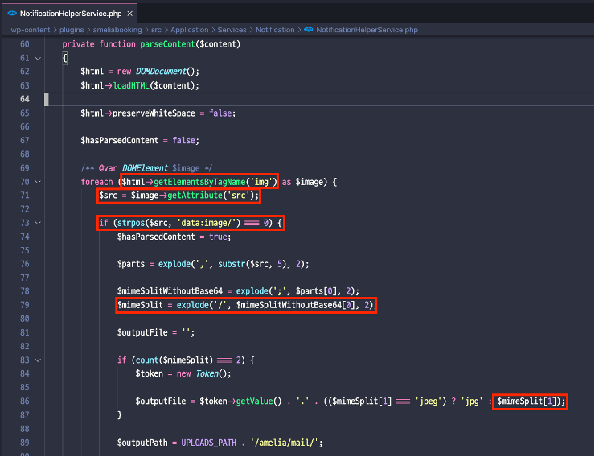
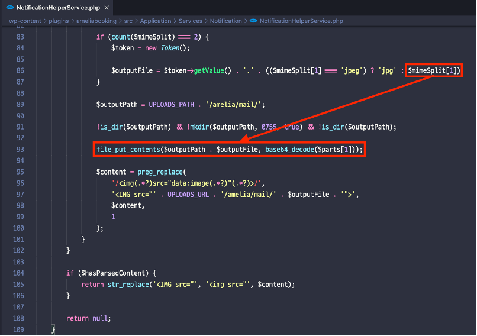
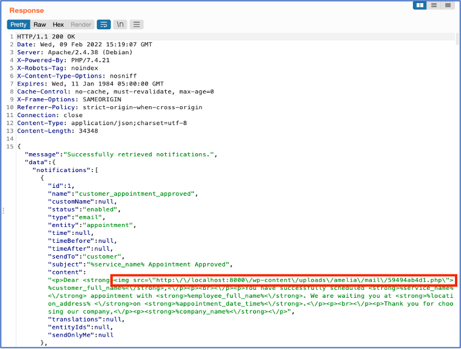
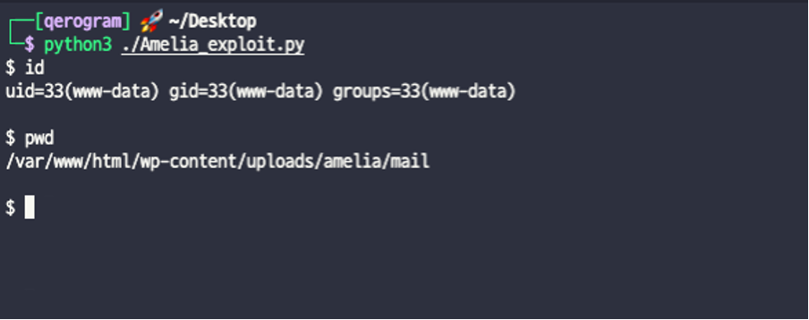

# CVE-2022-0687
[](https://opensource.org/licenses/MIT)
<br>

## Author
Qerogram<br><br>

## Version
 &nbsp; <br><br>

## Vulnerability
RCE (Remote Code Execution) via Arbitrary File Write<br><br>
<br><br>

## Description
The plugin stores image blobs into actual files whose extension is controlled by the user, which may lead to PHP backdoors being uploaded onto the site. This vulnerability can be exploited by logged-in users with the custom "Amelia Manager" role.
<br><br>

## Vector
|Method|Path|
|------|---|
|URI| Wpadmin -> Amelia -> Notification <br/>/wp-admin/admin-ajax.php?action=wpamelia_api&call=/notifications/1 - parameter : content|
|Local Path|/wp-content/plugins/ameliabooking/src/Application/Services/Notification/NotificationHelperService.php - parseContent ()|


<br><br>

## How To Trigger Vulnerability
When save the notification, function /wp-content/plugins/ameliabooking/src/Application/Services/Notification/NotificationHelperService.php - parseContent () is called.
The function has a function of parsing the "img" tag and storing the file locally. At this time, if this logic is abused, the user can upload the file with the desired extension and content.
 


You can upload the web shell with the following example.

```html

```

<br/>

> ## Example
```html

```

 

When the request is transmitted, the uploaded path is included in the response.


As a result, we get a execute command permission to server.


<br>

<br><br>
# Reference
[1] [Vendor](https://wordpress.org/plugins/ameliabooking/)